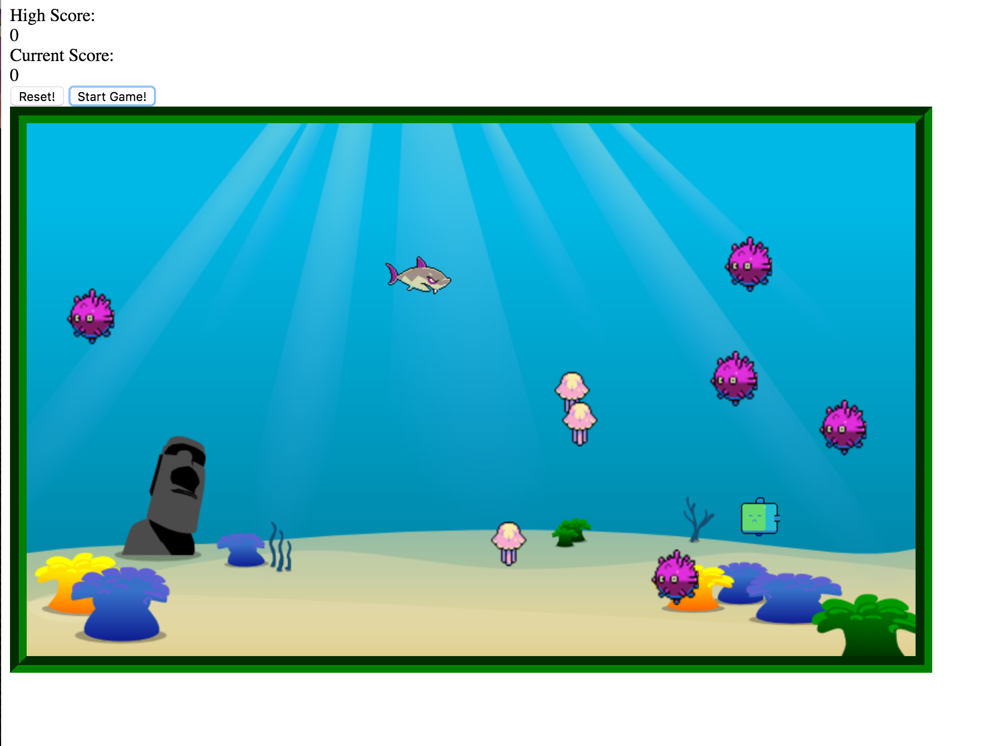

#Shark Game created with HTML5 Canvas
###Using Canvas drew png's and jpg's into HTML.

####In JavaScript added keylistner events on arrow keys to manipulate x+y coordinates of protagonist Mr. Shark.
#####Added sea-urchin and jelly-fish Enemies moving at random within confines of canvas.
#####If Mr. Shark x+y coordinates === Enemies x+y coordinates - game resets and score resets to 0.
#####Added "shark-bait" character
#####If Mr. Shark x+y coordinates === "shark-bait" x+y coordinates - Score++ and the "shark-bait" respawns at random location
